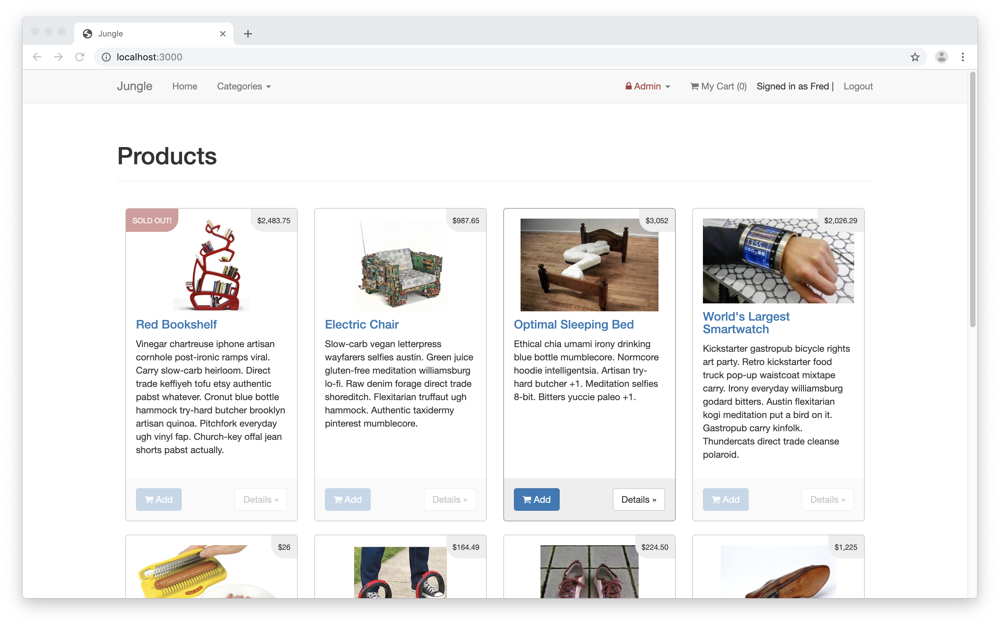
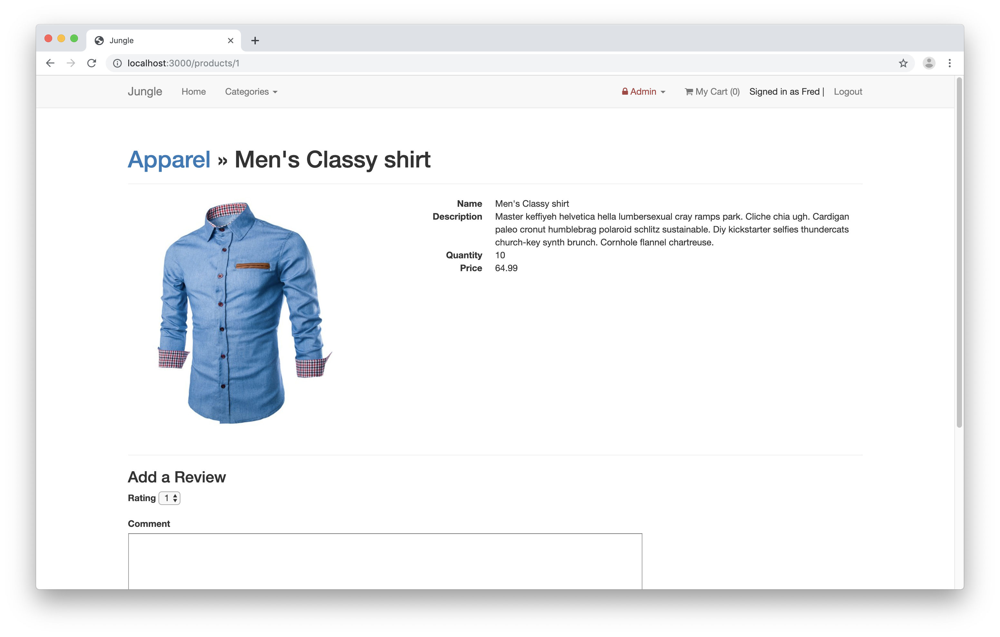
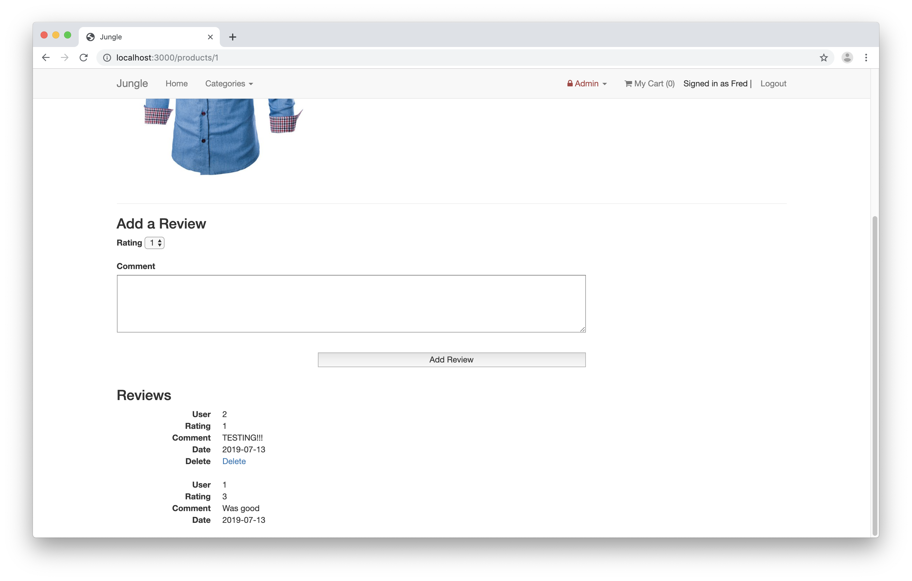
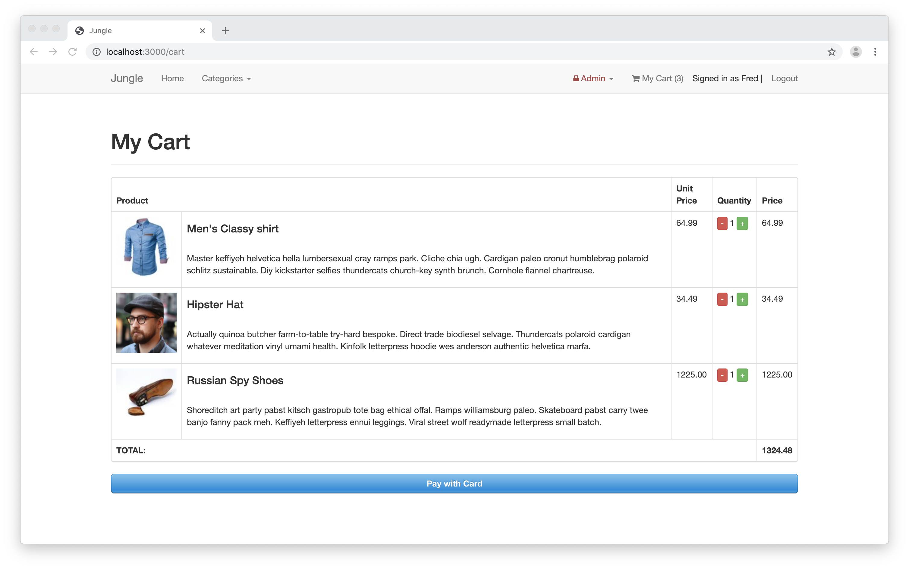
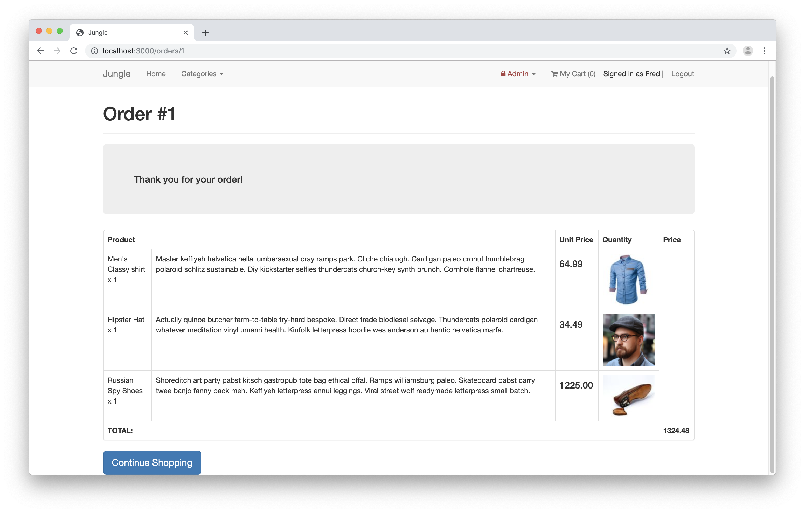

# Jungle

A mini e-commerce application built with Rails 4.2. The application was existing and features were added and bugs fixed.

## Screenshots

### Home Page


### Product Page


### Product Reviews


### Shopping Cart


### Purchase Summary



## Getting Started
- clone repository to your local machine
- in terminal, navigate to project directory and run ```bundle install```
- create a ```.env``` file as per ```.env.example```
- create a ```database.yml``` file as per ```database.example.yml```
- create a  ```secrets.example.yml``` file as per ```secrets.example.yml```
- Sign up for a [Stripe](https://stripe.com/) account
- copy Stripe keys into .env file
- type ```rails db:reset``` in terminal to re-seed the database and create the tables
- type ```bin/rails s -b 0.0.0.0``` in terminal to start the server
- navigate to ```localhost:3000``` in your browser
- use credit card number ```4111 1111 1111 1111``` and any date in the future for the credentials

## Dependencies

- [Rails 4.2](http://guides.rubyonrails.org/v4.2/)
- [PostgreSQL 9.x](https://www.postgresql.org/)
- [Stripe](https://github.com/stripe/stripe-ruby)
- [bcrypt](https://github.com/codahale/bcrypt-ruby)
- [bootstrap-sass](https://github.com/twbs/bootstrap-sass)
- [sass-rails](https://github.com/rails/sass-rails)
- [jquery-rails](https://github.com/rails/jquery-rails)
- [font-awesome-rails](https://github.com/bokmann/font-awesome-rails)
- [sdoc](https://github.com/zzak/sdoc)
- [uglifier](https://github.com/lautis/uglifier)
- [dotenv-rails](https://github.com/bkeepers/dotenv)
- [puma](https://github.com/puma/puma)
- [money-rails](https://github.com/RubyMoney/money-rails)
- [rmagick](https://github.com/rmagick/rmagick)
- [faker](https://github.com/stympy/faker)
- [quiet_assets](https://github.com/evrone/quiet_assets)
- [byebug](https://github.com/deivid-rodriguez/byebug)
- [turbolink](https://github.com/turbolinks/turbolinks)
- [jbuilder](https://github.com/rails/jbuilder)
- [carriewave](https://github.com/carrierwaveuploader/carrierwave)
- [web-console](https://github.com/rails/web-console)
- [spring](https://github.com/rails/spring)
